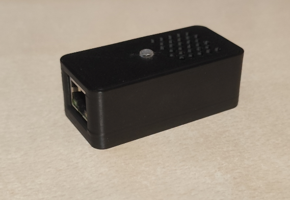
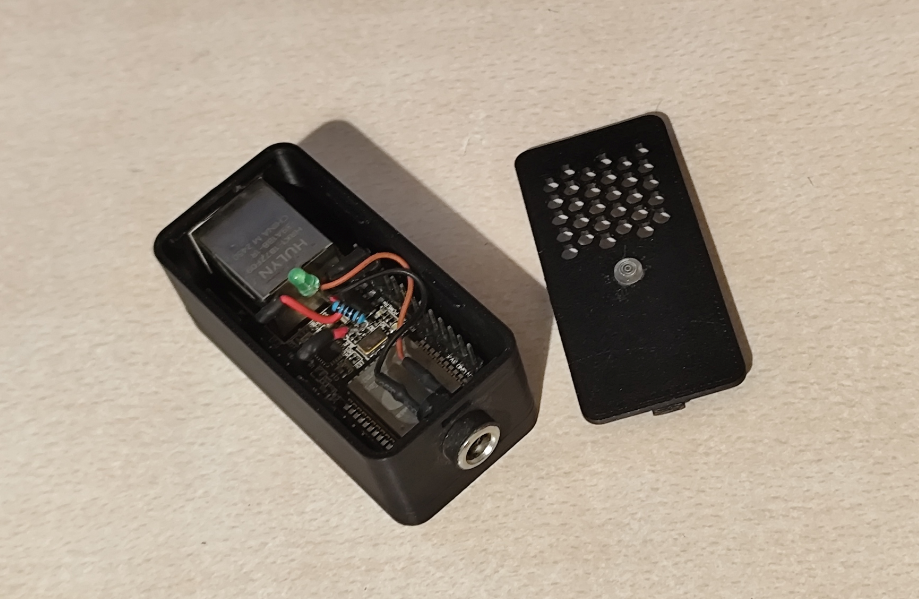
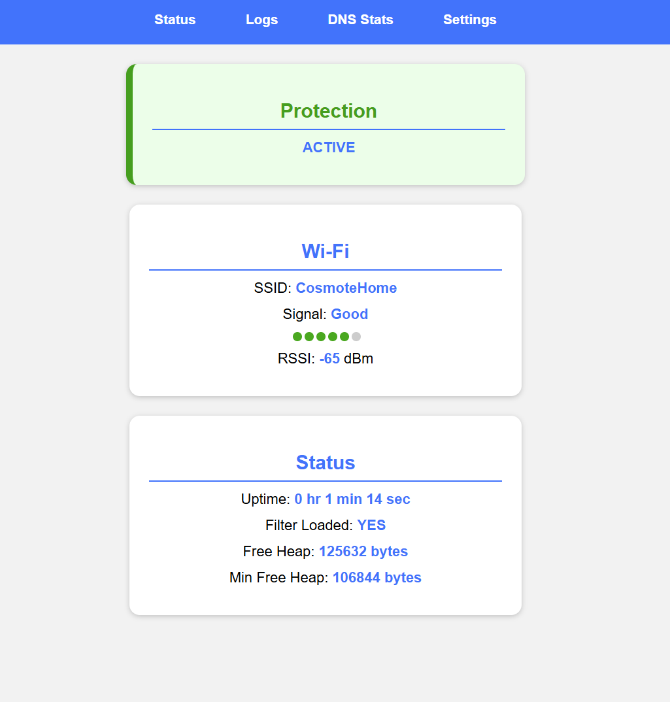
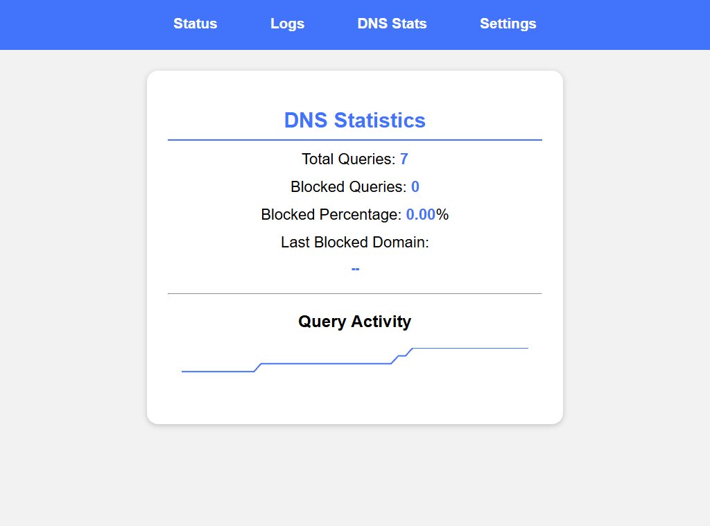
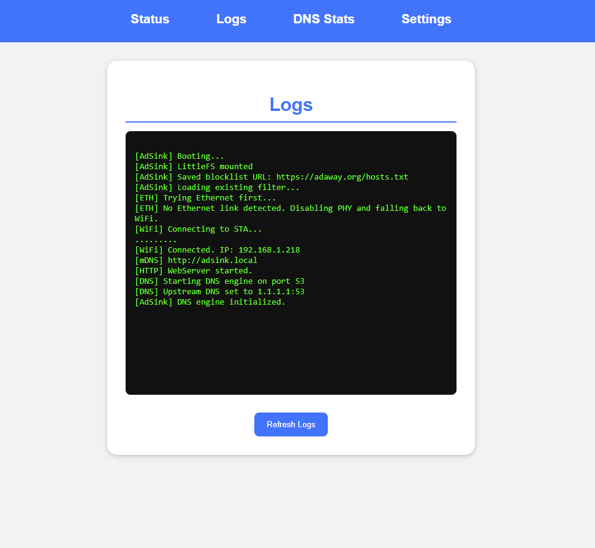
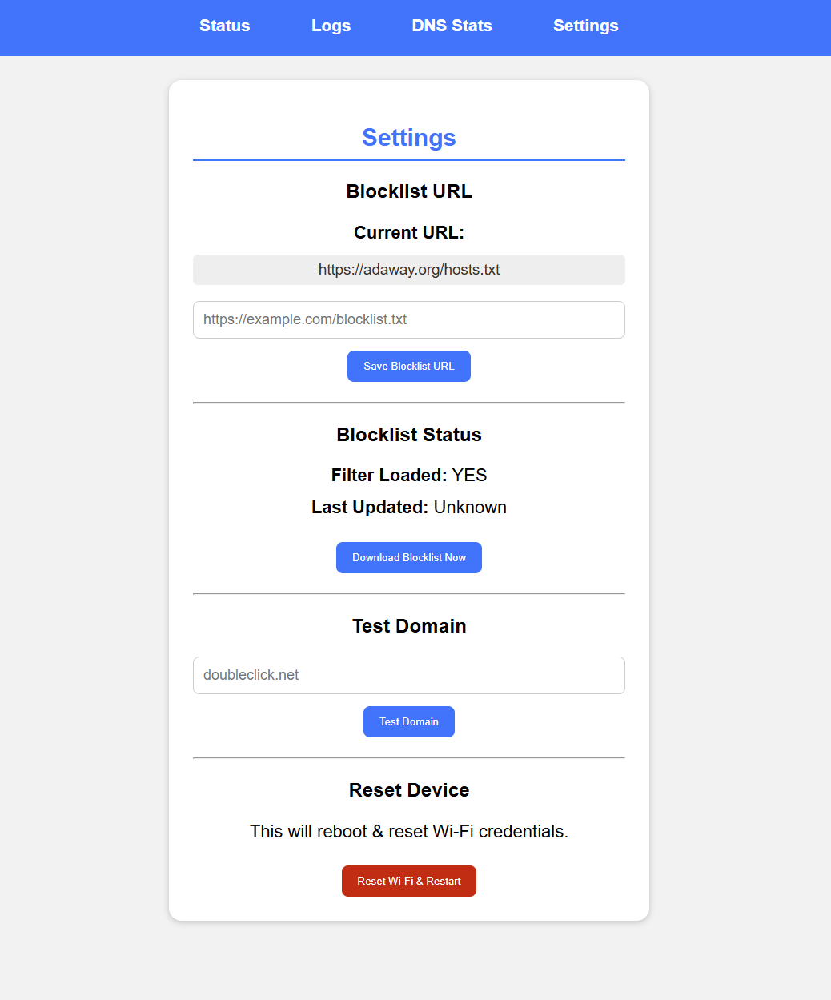

# Ad Sink — Network Adblocker (Powered by WT32)



A compact **DNS-based ad and tracker blocker** built around a **WT32 development board**.

AdSink operates as a lightweight DNS sinkhole, filtering requests against a locally stored blocklist while providing a browser-based interface for monitoring the system, viewing DNS statistics and logs, managing the blocklist, and testing individual domains.

## Motivation

While experimenting with development boards, I acquired a WT32 board and initially used it much like a conventional ESP32. Later, I wanted to find a practical application that would take advantage of its distinctive Ethernet capability. This led to the idea of creating a lightweight DNS sinkhole, ultimately resulting in AdSink.

## Features

- DNS-based ad and tracker blocking
- Bloom filter for fast domain lookups
- Persistent blocklist filter stored in LittleFS
- Configurable blocklist by URL
- Wi-Fi configuration through captive portal for setup
- Persistent Wi-Fi credentials and blocklist settings
- Ethernet support using the WT32/LAN8720 configuration in the firmware
- Web dashboard with live system information
- DNS statistics and query activity graph
- Browser-accessible runtime logs
- Manual domain testing from the web interface

## Hardware



The project intentionally uses very little external hardware:

| Component | Purpose |
|---|---|
| **WT32 development board** | Main controller and network interface |
| **Indicator LED** | Shows network connectivity |
| **Current-limiting resistor** | Recommended for the LED |
| **5 V supply** | Powers the board |

There are no external sensors, displays, buttons, or additional controllers required by the project.

### Status LED

The external indicator LED is controlled from **GPIO 14**.

| Condition | LED |
|---|---|
| Wi-Fi connected | ON |
| Ethernet connected with a valid IP | ON |
| No network connectivity | OFF |

The LED indicates **network connectivity only**. It does not directly indicate whether the blocklist is loaded or whether protection is active.

### Power

The WT32 is powered from **5 V** through the appropriate VIN/5V pin.

In some cases, a standard USB port may not provide sufficient power, particularly when Ethernet and Wi-Fi are active simultaneously. A stable 5 V supply is therefore recommended for reliable operation.

## Web Interface

AdSink includes a browser-based interface with four main sections:

- **Status** — protection state, network information, uptime, memory usage and filter state
- **Logs** — runtime and startup messages
- **DNS Stats** — query counters, blocked-query statistics and query activity
- **Settings** — blocklist configuration and updates, domain testing, and Wi-Fi reset

### Status Dashboard

The dashboard provides an at-a-glance overview of the device's current operating state.



The Status page reports:

- Protection state
- Wi-Fi SSID
- Wi-Fi RSSI / signal quality
- Uptime
- Whether the Bloom filter is loaded
- Free heap memory
- Minimum recorded free heap
- Ethernet status when applicable

Protection is considered active when a filter is loaded and the device has a valid Wi-Fi or Ethernet connection.

### DNS Statistics

The DNS Statistics page tracks total DNS queries, blocked queries, blocked percentage, the last blocked domain, and recent query activity.



The statistics page exposes:

- Total DNS queries
- Blocked DNS queries
- Blocked percentage
- Last blocked domain
- Query activity

These counters are maintained in memory and therefore represent activity for the current runtime session.

### Runtime Logs

The Logs page exposes the firmware's in-memory serial log buffer through the web interface.

This makes startup, network, DNS, and blocklist events easy to inspect without requiring a separate serial terminal.




### Settings

The Settings page provides the main configuration and maintenance controls, allowing the blocklist URL to be changed, the latest list to be downloaded, individual domains to be tested, and stored Wi-Fi credentials to be cleared.




The Settings page provides:

- Current blocklist URL
- Blocklist URL configuration
- Manual blocklist download
- Filter status
- Last blocklist update information
- Domain testing
- Wi-Fi credential reset

A domain can be tested directly from the Settings page without generating a normal client DNS request.
This is useful for verifying whether a domain is currently matched by the loaded filter.

## Operation Logic

```text
                     DNS Query
                         │
                         ▼
                ┌─────────────────┐
                │   WT32 AdSink   │
                │                 │
                │  DNS Engine     │
                │       │         │
                │       ▼         │
                │ Bloom Filter    │
                └───────┬─────────┘
                        │
               ┌────────┴────────┐
               │                 │
            MATCH             NO MATCH
               │                 │
               ▼                 ▼
           0.0.0.0          1.1.1.1:53
           (blocked)       (upstream DNS)
```

For each DNS request, the firmware:

1. Receives the DNS packet on UDP port `53`.
2. Parses the requested domain.
3. Checks the domain against the Bloom filter for `A` and `AAAA` queries.
4. If the domain matches the filter, returns a sinkhole response using `0.0.0.0`.
5. Otherwise forwards the original request to the upstream DNS server.
6. Returns the upstream response to the requesting client.

The default upstream DNS server is:

```text
1.1.1.1:53
```

## Blocklist and Bloom Filter

Instead of keeping the complete blocklist as a large collection of strings, AdSink converts the downloaded domains into a Bloom filter.

The firmware currently creates the filter with:

```cpp
BloomFilter filter(320000, 6);
```

That means:

- **320,000 bits** of filter space
- **6 hash functions**
- Approximately **40 KB** of raw filter storage

The Bloom filter provides fast membership testing while using considerably less memory than storing every domain as a conventional string list.

Using a Bloom filter is particularly important on the ESP32/WT32 platform, where available memory is limited and storing large blocklists as conventional strings would be considerably more expensive.

### False Positives

Bloom filters can produce **false positives**. In other words, a domain that is not actually present in the source blocklist may occasionally be reported as a match. This is the principal trade-off for the significant reduction in memory usage.

## Blocklist Format

The downloader is designed around hosts-style blocklists such as:

```text
0.0.0.0 example.com
127.0.0.1 tracker.example.org
0.0.0.0 ads.example.net # comment
```

Comments and empty lines are ignored while parsing.

The firmware currently uses these limits:

| Setting | Value |
|---|---:|
| Warning threshold | 40,000 domains |
| Maximum domains | 50,000 domains |
| HTTP timeout | 60 seconds |
| Global download timeout | 90 seconds |
| Network stall timeout | 10 seconds |

If the maximum domain count is reached, additional entries are not processed, preventing the filter-building process from growing indefinitely.

## Persistent Storage

### LittleFS

The generated Bloom filter is saved to:

```text
/filter.bin
```

This allows the filter to be restored after a reboot without rebuilding it immediately from the remote blocklist.

### Preferences / NVS

ESP32 Preferences is used for persistent configuration, including:

- Wi-Fi SSID
- Wi-Fi password
- Blocklist URL
- Last blocklist update time

The application uses the `adsink` NVS namespace.

## First Boot / Wi-Fi Setup

If no Wi-Fi credentials are stored, the WT32 starts its configuration access point:

```text
SSID: AdSink-Setup
IP:   192.168.4.1
```

Connect to `AdSink-Setup` and open:

```text
http://192.168.4.1/
```

The setup page scans for nearby Wi-Fi networks and allows a network to be selected and its password stored in persistent configuration.

After saving the credentials, the device restarts and attempts to connect in station mode.

## Network Operation

### Wi-Fi

The firmware connects to the stored Wi-Fi network and waits up to approximately **15 seconds** for a connection.

When connected, the device starts its HTTP server and mDNS service.

If mDNS is available on the local network, the web interface can be reached at:

```text
http://adsink.local
```

Otherwise, use the IP address printed in the serial log or shown on the dashboard.

### Ethernet

The firmware attempts Ethernet initialization first using the LAN8720 PHY configuration defined in `ConnectionManager.cpp`.

If no Ethernet link is detected during the initial check, the PHY is disabled and the firmware falls back to Wi-Fi.

The web dashboard can report Ethernet link state, IP address, and link speed when Ethernet is active.

> Ethernet availability depends on the exact WT32 hardware variant and its onboard Ethernet circuitry.

## DNS Server

AdSink listens for DNS requests on:

```text
UDP 53
```

The upstream resolver is:

```text
1.1.1.1:53
```

Upstream DNS requests use a timeout of **1500 ms**.

The current implementation parses the DNS question section and checks `A` (`1`) and `AAAA` (`28`) queries against the Bloom filter before either sinking or forwarding the request.

## Using AdSink for Network-Wide Filtering

AdSink is a **DNS server**, not a router.

For a client to be filtered, its DNS server must point to the WT32's IP address.

```text
             Client Device
                  │
                  │ DNS
                  ▼
           ┌──────────────┐
           │ WT32 / AdSink│
           └──────┬───────┘
                  │
          ┌───────┴────────┐
          │                │
       Blocked           Allowed
          │                │
          ▼                ▼
       0.0.0.0        1.1.1.1:53
```

This can be configured manually on individual clients or distributed network-wide through the router's DHCP/DNS configuration, depending on the network setup.

---

## Project Structure

```text
AdSink/
├── adSink.ino
├── BlocklistManager.cpp
├── BlocklistManager.h
├── BloomFilter.cpp
├── BloomFilter.h
├── ConnectionManager.cpp
├── ConnectionManager.h
├── DnsEngine.cpp
├── DnsEngine.h
├── JSONBuilder.cpp
├── JSONBuilder.h
├── LedControl.cpp
├── LedControl.h
├── SerialLogger.cpp
├── SerialLogger.h
└── Webpages.h
```

### Source Overview

| File | Responsibility |
|---|---|
| `adSink.ino` | Main initialization, loop, storage and system coordination |
| `ConnectionManager.*` | Wi-Fi, Ethernet, AP setup, web server and mDNS |
| `DnsEngine.*` | DNS parsing, filtering, forwarding and statistics |
| `BlocklistManager.*` | Blocklist download, parsing and filter generation |
| `BloomFilter.*` | Bloom filter implementation and persistence |
| `LedControl.*` | GPIO 14 status LED control |
| `SerialLogger.*` | Serial output and web-accessible log buffer |
| `JSONBuilder.*` | JSON response generation |
| `Webpages.h` | Embedded HTML/CSS/JavaScript for the web interface |

---

## Building and Uploading

The project targets the **ESP32 Dev Module** using the Arduino ESP32 framework.

The firmware uses ESP32 components including:

```text
WiFi
ETH
LittleFS
Preferences
WebServer
DNSServer
HTTPClient
mDNS
```

## Troubleshooting

### The web interface cannot be reached

- Make sure the client is on the same network.
- Confirm that the HTTP server started successfully.

### DNS requests are not blocked

Check that:

- A Bloom filter has been loaded.
- The dashboard reports the filter as loaded.
- The client is actually using the WT32 as its DNS server.
- The domain is represented in the loaded blocklist.

### Blocklist download fails

Check:

- Network connectivity
- The configured blocklist URL
- Internet access
- HTTP status/log messages
- Available memory
- Download size and timeout conditions

## Notes and Limitations

### Experimental Nature

AdSink is an experimental project developed for learning and demonstration purposes. It is not intended to provide guaranteed security, privacy, or complete protection against advertisements and trackers.

### Bloom Filter False Positives

A Bloom filter can report a match for a domain that was not present in the source list. This is an inherent trade-off of the data structure in exchange for compact, memory-efficient membership testing.

### DNS Is Not a Router

AdSink only filters DNS traffic that is sent to it. Clients using another DNS resolver are not automatically redirected to AdSink.


